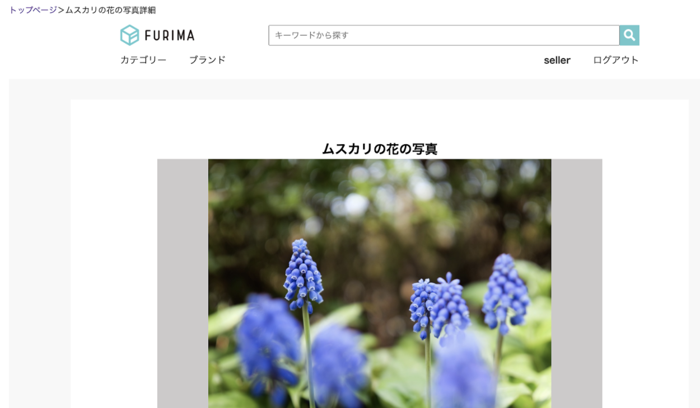

# 「Furima」概要

フリーマーケットのアプリケーションを作成しました。

## URL
https://furima-31051.herokuapp.com/

## テスト用アカウント
- 出品者用  
メールアドレス名: seller@test.com  
パスワード: test2222  
- 購入者用  
メールアドレス: buyer@test.com  
パスワード: test2222
- 購入用カード情報  
番号：4242424242424242  
期限：12月24年  
セキュリティコード：123  

## 利用方法
出品者用テストアカウントでログイン後、画面右下の「出品する」ボタンより商品出品画面に遷移し、商品をご出品ください。  
その後、購入者用テストアカウントでログイン後、商品詳細ページに遷移し、ご購入ください。

## 解決したい課題
様々なフリーマーケットアプリが存在する中、扱いやすい設計でなければ、利用してもらうことが難しいだろうと考えました。  
そこで、テックキャンプで定められた要件以外に、以下の点についてアプリケーションの改善を行いました。


## 要件定義
https://docs.google.com/spreadsheets/d/1Bd2DfpwL2TEN9hauyKhqXfjoExxBwVSV-7hVHxYsAhI/edit?usp=sharing

<br>

# 実装した機能と特徴
## 実装内容
洗い出した課題の中から、以下を実装しました。それぞれの仕様を紹介します。
- 商品参照画面から前後の商品へ移動する機能
- 商品画像のAmazon S3への保存機能
- 商品画像のプレビュー機能
- パンくず機能

## ・商品参照画面から前後の商品へ移動する機能
商品の閲覧、比較をしやすくするために、各商品一覧ページ下部にある「前の商品へ」「後ろの商品へ」ボタンに、前後の商品へのリンクを設定しました。 


## ・商品画像のAmazon S3への保存機能
herokuでは、定期的に画像データが削除されてしまい、商品画像がなくなってしまうのを防ぐため、画像データのみAmazon S3へ保存をするように変更を行いました。

## ・商品画像のプレビュー機能
商品投稿を完了するまで、自分の投稿した画像が正しいかどうかを確認できない仕様だったので、商品投稿の事前に確認をできるよう、プレビュー表示を実装しました。


## ・パンくず機能
TOPページを基準に現在の自分の位置を画面上部に表示するパンくず機能を実装しました。



<br>

# データベース設計

## users テーブル
| Colummns             | Type       | Options                       |
| -------------------- | ---------- | ----------------------------- |
| nickname             | string     | null: false, uniqueness: true |
| email                | string     | null: false                   |
| password             | string     | null: false                   |
| family_name_kanji    | string     | null: false                   |
| first_name_kanji     | string     | null: false                   |
| family_name_katakana | string     | null: false                   |
| first_name_katakana  | string     | null: false                   |
| birthday             | date       | null: false                   |

### Association
- has_many :items
- has_many :orders

## items テーブル
| Colummns                | Type       | Options                        |
| ----------------------- | ---------- | ------------------------------ |
| name                    | string     | null: false                    |
| description             | text       | null: false                    |
| category_id             | integer    | null: false                    |
| product_condition_id    | integer    | null: false                    |
| shipping_fee_bearer_id  | integer    | null: false                    |
| prefecture_id           | integer    | null: false                    |
| days_to_ship_id         | integer    | null: false                    |
| price                   | integer    | null: false                    |
| user                    | references | null: false, foreign_key: true |

### Association
- belongs_to       :user
- has_one_attached :image
- has_one          :order
- belongs_to_active_hash :category
- belongs_to_active_hash :product_condition
- belongs_to_active_hash :shipping_fee_bearer
- belongs_to_active_hash :prefecture
- belongs_to_active_hash :days_to_ship

## orders テーブル
| Colummns     | Type       | Options                        |
| ------------ | ---------- | ------------------------------ |
| user         | references | null: false, foreign_key: true |
| item         | references | null: false, foreign_key: true |

### Association
- belongs_to    :user
- belongs_to    :item
- has_one       :delivery_address
- attr_accessor :token <!-- Pay.jpのトークン -->

## delivery_addresses テーブル
| Colummns          | Type       | Options                        |
| ----------------- | ---------- | ------------------------------ |
| zipcode           | string     | null: false                    |
| prefecture_id     | integer    | null: false                    |
| city              | string     | null: false                    |
| block             | string     | null: false                    |
| building_and_room | string     |                                |
| telephone_number  | string     | null: false                    |
| order             | references | null: false, foreign_key: true |

### Association
- belongs_to :order
- belongs_to_active_hash :prefecture

<br>

# ローカル環境での動作方法
ターミナルで以下の通りにコマンド入力してください。  
（Ruby on Railsのバージョン6.0.0で作成しています。）
1. 任意のディレクトリを開きます。  
※「~/repositories」の部分は任意のディレクトリを指定します。
2. リポジトリをクローンします。
3. llgamelandディレクトリに移動します。
4. Gemをインストールします。
5. JavaScriptのパッケージをインストール
6. データベースを生成します。
7. データベースにデータを登録します。
```
1. cd ~/repositories
2. git clone https://github.com/lynxlevin/furima-31051.git
3. cd furima-31051
4. bundle install
5. yarn install
6. rails db:migrate
7. rails db:seed
```
